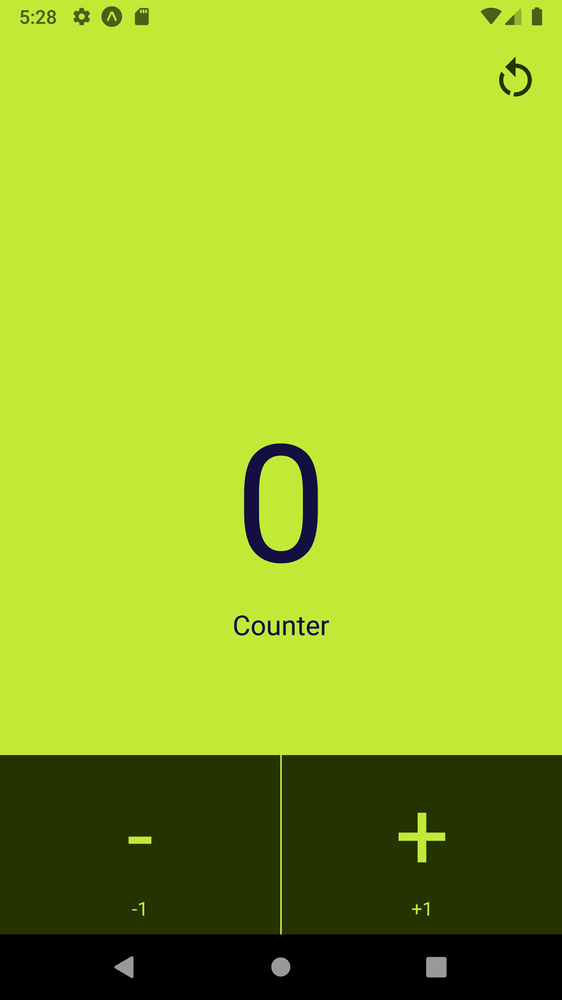
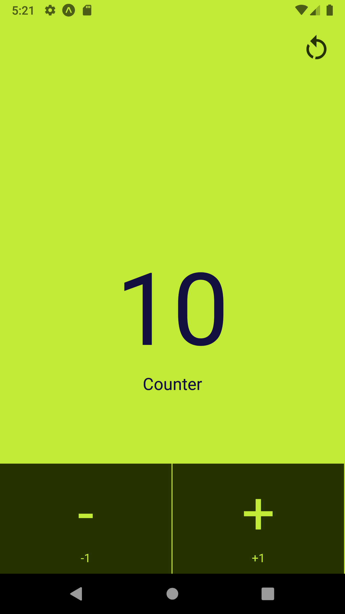

# Cuonter-app-react-native
 A simple attractive  counter app tutorial for youtube channel

## main principal lessons from this project
- [ ] Understanding the core concept of building UI with react native
- [ ] executing actions with the help of TouchableOpacity component
- [ ] Managing state with UseState 

UI Preview                 |  UI Preview
:-------------------------:|:-------------------------:
  | 

- used  colors : 
 COLOR DARK  : #1F2328
 COLOR Gray : #121416

Made with ❤ in Algeria 
by : <a href= 'https://www.instagram.com/ilies_ouldmenouer/' >ilies Ouldmenouer</a> 
